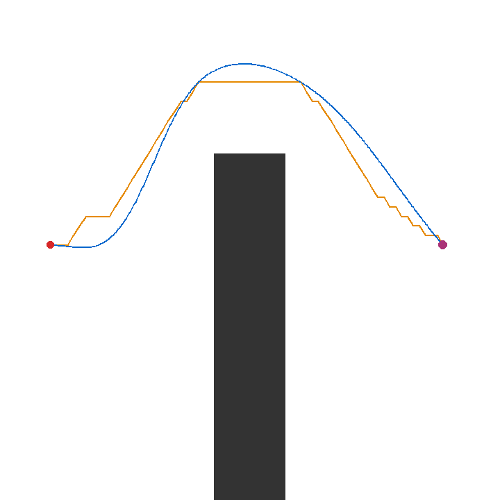

# Robot Navigation Lab

從靜態地圖規劃一條車輛可追蹤的軌跡，並在同一個 kinematic bicycle 模擬器中比較傳統控制與 PPO 的可重現實驗平台。第一版使用真值定位；它展示規劃、控制與實驗如何串接，並不宣稱包含感知、SLAM 或實車部署。



這是已保存的端到端 A* detour + pure-pursuit rollout；[原始 trace、manifest 與完整結果](docs/results/README.md)可重算其指標。

```text
scenario → A* / RRT* → validated trajectory + speed profile
         → shared bicycle actuator + longitudinal controller
         → classical steering policy / optional PPO steering policy
         → trace.csv + metrics + plot + replay GIF
```

## 快速開始

在此目錄建立環境並安裝：

```bash
python3 -m venv .venv
.venv/bin/python -m pip install -e '.[dev]'
```

執行一筆無 GUI 的端到端 demo：

```bash
.venv/bin/navlab demo --scenario detour --planner astar \
  --controller pure_pursuit --seed 0 --output outputs/detour-pp
```

它會產生 `run.json`、`trace.csv`、`trajectory.csv`、`overview.png`、`replay.gif`。所有圖與指標由同一次 rollout 的 trace 生成。`narrow` 是車身無法通過的反例，預期輸出可追溯的規劃或軌跡失敗，而非偽造成功。

```bash
.venv/bin/navlab benchmark --quick --seed 0 --output outputs/quick-benchmark
.venv/bin/python -m pytest
```

`--quick` 只跑縮小矩陣以驗證管線；`benchmark.json` 明確記錄它和完整矩陣的差異。完整 benchmark 保留：端到端漏斗、相同 reference trajectory 下的 controller 比較、以及 backward speed pass × lookahead braking 2×2 消融。

PPO 是選裝功能（`pip install -e '.[rl]'`）。它固定讀取 40 維 observation 與一維 tanh-bounded steering action，並用共用縱向控制；legacy HW3 checkpoint 與此 contract 不相容，不會載入。

```bash
# CPU，三個獨立 training seed；每個 seed 的步數是明確有限預算。
.venv/bin/navlab train --output outputs/ppo --steps 12288 --seeds 0 1 2
.venv/bin/navlab evaluate --checkpoint outputs/ppo/seed-0/best_checkpoint.pt \
  --split test --episodes 20 --output outputs/ppo/eval-seed-0
```

A validation-selected CPU checkpoint and its original results are included:

```bash
.venv/bin/navlab evaluate \
  --checkpoint examples/checkpoints/ppo_tracking_seed0_best.pt \
  --split test --episodes 20 --output outputs/ppo-seed0-test
```

The checked-in [reproduced results](docs/results/README.md) state the complete
three-seed held-out PPO result beside all five classical baselines, and retain
the raw CSV/JSON, PNG and GIF evidence for representative success and failure
cases.

## 離線互動展示

封存資料可建立成不依賴網路或 repo 路徑的單檔互動展示：

```bash
.venv/bin/navlab showcase --results docs/results --output outputs/showcase
```

輸出資料夾可直接以 `file://` 開啟，包含案例切換、逐步重播、同路線策略
比較與原始資料下載。完整操作與資料契約見 [展示說明](docs/showcase.md)。

訓練只取固定的 train geometry seed 集合；三個 checkpoint 都在相同的 validation routes 上比較後才選擇。選擇完成後，三個 PPO checkpoint 與五個古典 controller 都在固定 20 個 held-out test episodes 跑一次並保留逐集資料。checkpoint 保存 observation schema、環境/route set 版本、程式 digest、網路/optimizer、設定、seed、步數與 RNG state；載入時會拒絕不相容的 observation schema 或動作維度，來源 digest 則供追溯程式版本。

## 可重現性與公平比較

每筆 run 保存 command、seed、車輛設定、依賴版本與程式來源 digest。控制器共享 bicycle dynamics、同源的有限 preview/reference 資訊、參考速度、縱向控制器、動作限幅和 episode 規則；PPO 將其編碼為 clipped/normalized 40 維 observation，古典控制器讀取未正規化的 `PolicyInput`。失敗回合會保留在 benchmark 分母。只有成功回合才報 time-to-goal。

速度/煞車消融也報 max overspeed 與 `abs(v² tan(δ) / wheelbase)` 的 max/p99。後者是 kinematic bicycle 的模型內側向加速度估計，用於同模型下的比較，不是輪胎或實車抓地量測。

`configs/default.toml` 是人可閱讀的有效 reference defaults；目前 CLI 不讀取它，因此每次實際使用的設定以 `run.json` 和 command flags 為準。

更完整的契約、方法與限制請看 [方法與限制](docs/method-and-limits.md)，來源狀態請看 [來源說明](docs/sources.md)。
規劃與軌跡的可審查設計在 [Planning design](docs/planning-design.md)；控制模型與限制見 [Control design](docs/control-design.md)。

失敗案例：[為什麼可行路徑仍會撞](docs/failure-case.md)。

## 授權

本作品以 [MIT License](LICENSE) 發布。
