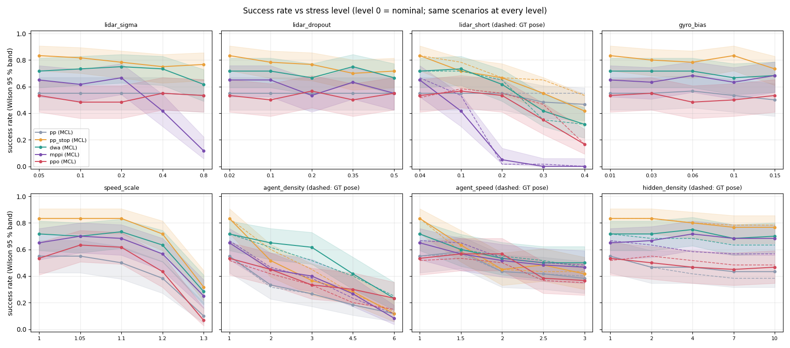
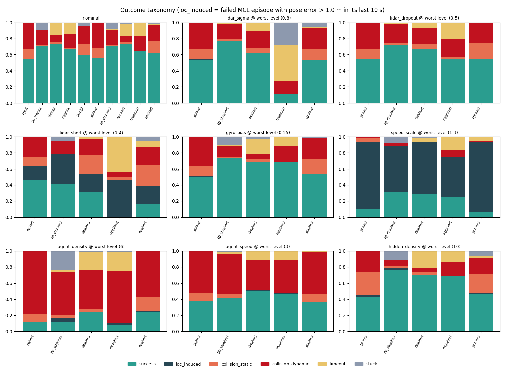
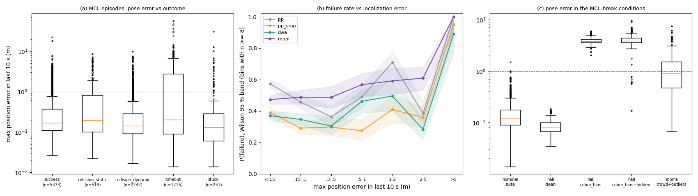
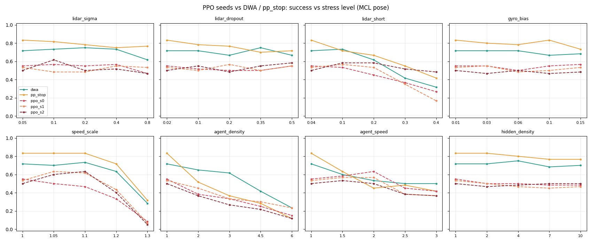
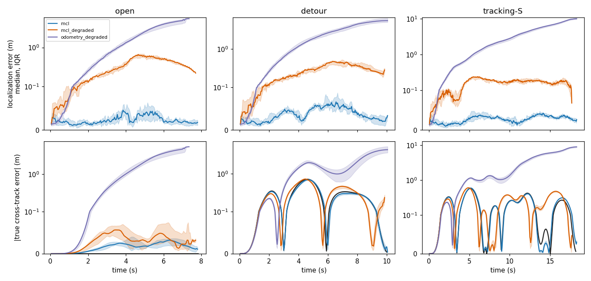

# navlab: where do navigation stacks break under uncertainty?

A 2-D car-like robot navigates procedurally generated maps with a noisy LiDAR, biased odometry, a Monte Carlo localizer (MCL), unmapped static boxes and moving pedestrians. The project asks one question:

> As sensing noise, odometry bias, crowd density / speed and map mismatch increase, where and how does each navigation stack break?

Four stacks (a pure-pursuit reference, pure pursuit with a stop rule, a car-like DWA, an MPPI planner) and a PPO-learned local planner are compared on the same frozen test scenarios, with paired statistics. Everything runs on a CPU simulator written for this project; there is no real-robot or ROS component.

## Summary of findings

The numbers below are rendered from `docs/results/benchmark/*.csv` by `navlab.benchmark.readme_block` (`python -m navlab.benchmark.readme_block --write`), and `tests/test_readme_numbers.py` fails if they drift from the CSVs. Findings marked *exploratory* were added after the results were seen (see Limitations).

<!-- headline:begin -->
1. **Nominal (n = 240 test scenarios, MCL pose; success [Wilson 95 % CI]):** pp 0.56 [0.50, 0.62], pp_stop 0.70 [0.64, 0.75], dwa 0.73 [0.67, 0.78], mppi 0.64 [0.58, 0.70], ppo 0.62 [0.55, 0.68]. DWA vs pp_stop: +2.9 points, Holm p = 1.000 (not significant); pp_stop vs pp (no replanning, ignores the scan): +13.8 points, Holm p < 0.001. Replacing GT pose by MCL changes any planner's nominal success by at most 2.9 points (none of the F2 GT-vs-MCL tests is significant after Holm).
2. **Scan noise breaks stacks differently (exploratory).** Gaussian range noise sigma 0.05 to 0.8 m: MPPI -53 points, every other planner within 10 points. Short-return rate (phantom close obstacles) 0.04 to 0.4: pp_stop 0.83 to 0.42, dwa 0.72 to 0.32, mppi 0.65 to 0.00, ppo 0.53 to 0.17.
3. **Odometry scale error and crowds hurt every planner (exploratory).** Odometry speed scale 1.0 to 1.3: pp -45, pp_stop -52, dwa -43, mppi -40, ppo -47 points; the pooled median last-10 s pose error rises from 0.11 m to 3.60 m (88 % of episodes above 1 m), but the GT-pose arm was not run on this axis, so the effect of pose error and of the speed mismatch itself is not separated. Agent density 1 to 6 per 1000 m^2: pp -43, pp_stop -72, dwa -48, mppi -57, ppo -30 points.
4. **Localization becomes the failure where the map gives it nothing to lock onto (exploratory).** In a featureless hall with gyro bias 0.1 rad/s and speed scale 1.2 (`hall/odom_bias`; success with GT pose vs MCL pose): pp 1.00 vs 0.65, pp_stop 1.00 vs 0.65, dwa 1.00 vs 0.68, mppi 1.00 vs 0.37, ppo 1.00 vs 0.02. The same hall without odometry bias is solved by every planner with MCL (1.00 minimum).
5. **The learned local planner (PPO, 3 seeds) is worse than DWA and pp_stop on the frozen test set.** All 12 pre-declared seed-vs-baseline nominal tests have a negative difference (largest Holm p = 0.026); headline seed ppo_s1 vs DWA -11.2 points (Holm p = 0.009), vs pp_stop -8.3 points (Holm p = 0.026), MCL pose. Seed variance is large out of distribution: success in `hall/odom_bias` with MCL, ppo_s0 / ppo_s1 / ppo_s2 = 0.60 / 0.02 / 0.70.

Change in success (percentage points, MCL pose, 60 paired scenarios per cell) from the nominal level to the worst level of each stress axis (exploratory; the full per-level tables with confidence intervals are in the benchmark report):

| axis (nominal to worst) | pp | pp_stop | dwa | mppi | ppo |
|---|---|---|---|---|---|
| lidar_sigma (0.05 to 0.8) | -2 | -7 | -10 | -53 | +0 |
| lidar_dropout (0.02 to 0.5) | +0 | -12 | -5 | -10 | +2 |
| lidar_short (0.04 to 0.4) | -8 | -42 | -40 | -65 | -37 |
| gyro_bias (0.01 to 0.15) | -5 | -10 | -3 | +3 | +0 |
| speed_scale (1 to 1.3) | -45 | -52 | -43 | -40 | -47 |
| agent_density (1 to 6) | -43 | -72 | -48 | -57 | -30 |
| agent_speed (1 to 3) | -17 | -42 | -22 | -18 | -17 |
| hidden_density (1 to 10) | -12 | -7 | -2 | +3 | -7 |

MCL-break suite, success with GT pose / MCL pose (60 scenarios per condition; exploratory):

| condition | pp | pp_stop | dwa | mppi | ppo |
|---|---|---|---|---|---|
| hall/clean | 1.00 / 1.00 | 1.00 / 1.00 | 1.00 / 1.00 | 1.00 / 1.00 | 1.00 / 1.00 |
| hall/odom_bias | 1.00 / 0.65 | 1.00 / 0.65 | 1.00 / 0.68 | 1.00 / 0.37 | 1.00 / 0.02 |
| hall/odom_bias+hidden | 0.72 / 0.47 | 0.93 / 0.55 | 0.98 / 0.67 | 1.00 / 0.32 | 0.95 / 0.03 |
| rooms/crowd+outliers | 0.05 / 0.03 | 0.03 / 0.02 | 0.03 / 0.05 | 0.00 / 0.00 | 0.05 / 0.02 |

Recorded wall times (14 worker processes): tuning 31 min, baseline test suites 72 min, PPO test suites 14 min (PPO training time per seed is in the benchmark report).
<!-- headline:end -->

Read these together with the caveats under *Limitations*: the planners did not get equal tuning effort, so "which planner is best" is hedged. The robust parts are the differences between conditions for a given planner and the failure signatures.

## Pipeline

```
 procedural scenario (family, seed, stress parameters)
   map + hidden (unmapped) boxes + pedestrians + start/goal
        |
        v
 true state (bicycle model) --> LiDAR (DDA ray casting + Thrun beam noise: Gaussian, short, max, random)
        |                       odometry (velocity motion model, gyro bias, speed-scale error)
        |                                  |
        |                                  v
        |                       MCL (likelihood field, low-variance resampling; augmented recovery is implemented but off in the frozen config)
        |                                  | estimated pose
        v                                  v
 scan costmap <-------------- global layer: A* on the KNOWN map, replan on blocked path,
        |                       reverse-and-replan recovery, give-up after 3 recoveries
        v                                  | global path
 LocalPlanner contract: (estimated pose, odometry speed, steering, scan, path, goal) -> (accel, steer rate)
        |-- pp        pure pursuit, ignores the scan (reference)
        |-- pp_stop   pure pursuit + scan-based stop/slow rule
        |-- dwa       dynamic window for a bicycle (admissible stopping, clearance cost)
        |-- mppi      sampling-based MPC on the scan costmap
        `-- ppo       PPO policy on min-pooled scan sectors + path/goal features
        |
        v
 outcome: success | collision_static | collision_dynamic | timeout | stuck  (+ loc_induced label for MCL runs)
```

Planners never see the true pose, the obstacle list or the hidden boxes; a structural test forbids the planner modules from importing the world.

## Evaluation protocol

* **Split by seed.** Tuning scenarios use seeds 0-999, test scenarios seeds >= 100000; `navlab.benchmark.splits` refuses anything else. PPO trains on a third range (1000-99999) and is selected on tuning seeds only.
* **Freeze before test.** Planner, global-layer, sensor and MCL configs are written to `docs/results/benchmark/frozen_config.json` before any test episode. Its `hash` field (`de26663d...`) is the SHA-256 of the *canonical JSON of the config without that field*, not the SHA-256 of the file's bytes; a separate `code_digest` is the SHA-256 over the source files of the stack under test. The test suites refuse to run if either check fails. The PPO artifact `ppo_frozen.json` chains to that baseline freeze and adds per-seed weight SHA-256s. (`python -c "from navlab.benchmark.config import load_frozen"` and `navlab.benchmark.ppo_freeze.load_ppo_frozen` recompute and verify these.)
* **Paired design.** Every planner and pose source (ground truth vs MCL) runs on the same `(family, seed)` scenarios. Stress levels share map, route and nested hidden/agent candidates with the nominal scenario (common random numbers).
* **Statistics.** Success rates with Wilson 95 % intervals; planner comparisons with the exact McNemar test and a paired bootstrap of the success difference; Holm correction within pre-declared families (F1-F2 confirmatory, F3-F5 and F7-F8 exploratory, F6 PPO vs baselines confirmatory). 15,360 episodes in the baseline test set and 11,520 for the three PPO seeds.
* **Outcome taxonomy.** A failed MCL episode whose pose error exceeded 1 m during its last 10 s is labelled `loc_induced`; this is correlational, and a GT-pose rescue rate is reported as the counterfactual check.

The full tables, tuning log and per-test results are in [`docs/results/benchmark/README.md`](docs/results/benchmark/README.md) (generated).

## Key figures

| | |
|---|---|
|  |  |
| Success rate vs stress level, per axis and planner (Wilson bands). | Outcome composition per planner and condition. |
|  |  |
| Pose error vs failure rate; MCL breaks where the map is featureless. | PPO seeds under stress. |
|  | |
| MCL pose error, illustrative runs (not evidence). | |

## Reproduce

```bash
python3 -m venv .venv && .venv/bin/python -m pip install -e '.[dev]'     # add '.[rl]' for PPO training (torch)

.venv/bin/python -m pytest -p no:metadata -p no:cacheprovider -q          # unit + integration tests
.venv/bin/python -m navlab benchmark-uncertainty --quick                  # smoke run on the tuning split (not evidence)
.venv/bin/python -m navlab benchmark-uncertainty --suite report           # rebuild tables/figures from the committed CSVs (seconds)
.venv/bin/python -m navlab.benchmark.readme_block --write                 # refresh the generated block above
```

Full reproduction (tuning, freeze, test suites, report; the recorded run took the wall times listed in the findings block on 14 worker processes):

```bash
.venv/bin/python -m navlab benchmark-uncertainty --suite all --workers 14
# learned planner: train 3 seeds (about 2.4 M env steps, 141 min each on one GPU), select, freeze, evaluate on the same test set
.venv/bin/python -m navlab.rl.train --seed S --out outputs/ppo_train        # S = 0, 1, 2
.venv/bin/python -m navlab.rl.finalize
.venv/bin/python -m navlab benchmark-uncertainty --suite ppo --workers 14
.venv/bin/python -m navlab benchmark-uncertainty --suite report
```

`--suite all` reuses an existing `frozen_config.json` and only tunes and freezes when it is absent; delete that file only if you intend to re-tune and re-freeze.

## Limitations

* **Tuning effort was asymmetric.** pp_stop got 37 candidate parameter sets, DWA and MPPI 9 each, pp none (it is a reference). Claims about which planner is best are hedged; the nominal DWA vs pp_stop difference is not significant.
* **Exploratory sections.** The break matrix, the localization-by-condition table and the MCL-break failure table were added after seeing the results and are labelled exploratory in the report. The pre-declared tests are F1-F2 and F6 (confirmatory) and F3-F5, F7-F8 (exploratory by declaration).
* **Pedestrian courtesy favours planners that stop.** Pedestrians do not walk into a nearly stationary car (speed < 0.3 m/s); a planner that brakes to a halt gets this for free. `pp` has no replanning or recovery by design, so its gap to the others is partly a design difference.
* **PPO caveats.** The headline seed (ppo_s1) is the one with the median tuning-split score, chosen by a rule fixed before test. Seed variance is large on the hall conditions (finding 5 gives the per-seed numbers). The policy was trained with surrogate pose noise, not the real MCL. Improving PPO now would require a fresh test split, because this one has been looked at.
* **Simulator scope.** 2-D LiDAR with a ray-disc dynamic obstacle model, non-reactive pedestrians (apart from the courtesy), one vehicle model, small synthetic maps (60 m x 36 m), one factor at a time (interactions only in the MCL-break suite). Confidence intervals describe scenario sampling, not seed-to-seed planner variance.
* **Axis confounds.** The odometry speed-scale axis enters through the filter's motion model and through the speed fed back to the controllers; the GT-pose arm was not run on it, so these paths are not separated.
* No real sensor data, no SLAM, no tire model.

## Repository layout

| path | contents |
|---|---|
| `src/navlab/perception` | LiDAR (DDA + beam model), odometry model, MCL |
| `src/navlab/world`, `maps` | procedural generator, dynamic/hidden obstacles, occupancy maps |
| `src/navlab/local` | `LocalPlanner` contract, scan costmap, DWA, MPPI, pp_stop |
| `src/navlab/navigation` | global layer, closed-loop episode runner, planner registry |
| `src/navlab/benchmark` | splits, conditions, frozen config, runner, statistics, report |
| `src/navlab/rl` | PPO local planner (features, NumPy policy, env, trainer, freeze) and frozen weights |
| `src/navlab/{planning,trajectory,control,evaluation,sim}` | classical A*/RRT*, trajectory and tracking controllers (components, and the original project) |
| `docs/results/benchmark` | generated benchmark report, CSVs, figures, freeze artifacts |
| `docs/legacy` | results and figures of the original tracking-comparison project |
| `docs/method-and-limits.md`, `docs/sources.md` | methods with references; provenance and development process |

## Provenance

The project started from three course assignments: HW1 (A* / RRT* path planning), HW2 (path tracking for a bicycle model) and HW3 (PPO steering control). Those became the first version of this repository: five tracking controllers compared with ground-truth localization, a braking ablation and a path-tracking PPO, with an offline showcase. That material is kept under `docs/legacy` and `navlab.experimental`, and the classical planners and controllers are reused as components.

New on this branch: the LiDAR and odometry models, MCL, unmapped dynamic and static obstacles, the scan costmap and `LocalPlanner` contract, DWA, MPPI, the global replanning and recovery layer, the procedural generator, the frozen paired stress benchmark, and the PPO local planner with its negative result. The old showcase was removed rather than repointed. See [`docs/sources.md`](docs/sources.md) for the development process (AI-assisted, owner-directed) and [`docs/method-and-limits.md`](docs/method-and-limits.md) for methods and references.

Licensed under the [MIT License](LICENSE).
