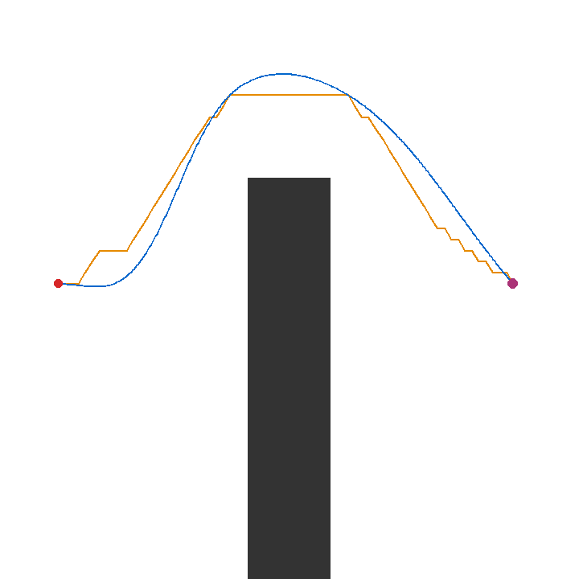

# 為什麼可行路徑仍會撞：後向速度 pass × 前瞻煞車消融

這不是規劃失敗：A* 的 `detour` 路徑與 C2 軌跡都通過幾何檢查，碰撞發生在閉環追蹤。回合固定為 seed 0、pure pursuit、2,500 次規劃預算，並同時關閉 `backward_pass` 與 `lookahead_braking`。保留的 [run](results/classical-ablation-no-backward-no-braking-run.json)、[trace](results/classical-ablation-no-backward-no-braking-trace.csv)、[trajectory](results/classical-ablation-no-backward-no-braking-trajectory.csv) 與 [矩陣](results/classical-benchmark.json) 可重算結論。

## Trigger

Profile 終點仍設 `v_ref=0`，但無後向 pass 時不會從終點反推可煞停的前段速度。此軌跡在 `s=39.57 m` 仍為 8.0 m/s，接著在 39.67 m 降至 4.99、39.77 m 降至 2.32，終點才為 0。無前瞻煞車時，`src/navlab/control/longitudinal.py` 只取目前／第一個 preview 目標，不再檢查所有 preview 的煞車 envelope。

## Observation and localisation

step 167 已記錄 `v_ref=0`、實速仍為 8.0 m/s；受最大減速限制後，step 173 仍以 7.10 m/s 掃掠碰撞。回合為 8.70 s、progress 39.80 m、max overspeed 8.00 m/s：車確實前進，但沒有足夠距離停下。

## Restored controls and limits

只開前瞻煞車即成功（10.0 s、overspeed 0.314 m/s）；只開後向 pass 也成功（9.7 s、0.352 m/s）；兩者皆開為 10.0 s、0.313 m/s。這只支持兩個 guard 在此固定 kinematic bicycle、真值定位、單一 rollout 中互補；不代表任一者保證其他地圖或實車安全。
