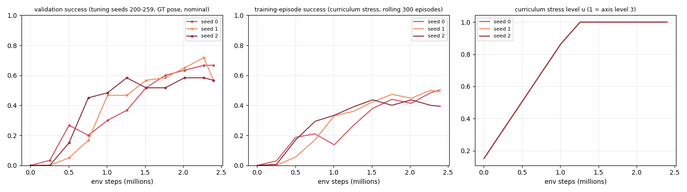

# Navigation under uncertainty: benchmark results

*This file is generated by `python -m navlab.benchmark.report` / `navlab benchmark-uncertainty --suite report` from `episodes.csv`; every number below is computed, none is typed by hand.*

**Research question.** As sensing noise, odometry bias, crowd density / speed and map mismatch increase, where and how does each navigation stack break?

## Protocol (what makes these numbers evidence)

* **Procedural scenarios** (`navlab.world.generator`): four seeded families (corridor network, rooms + doors, cluttered field, and a featureless hall used only for the MCL-break suite). A scenario is fully determined by `(family, seed, stress parameters)`. Start/goal are sampled with a minimum distance and an A* route at the global planner's clearance; hidden (unmapped) boxes are accepted only if such a route still exists on the *true* map.
* **Strict split by seed.** Tuning set = seeds 0-999; test set = seeds >= 100000 (`navlab.benchmark.splits` refuses anything else). Planner parameters were looked at on the tuning set only (see *Tuning*). The five hand-made P2 scenarios (`examples/dynamic_obstacle_navigation.py`) are *illustrative cases*, not evidence, and are not used here.
* **Freeze before test.** All planner / global-layer / sensor / MCL configs are written to `frozen_config.json` together with a `hash` field (the SHA-256 of the canonical JSON of the config without that field, i.e. not the SHA-256 of the file bytes) and a `code_digest` (SHA-256 over the source files of the stack under test). The test suites refuse to run if the file is missing, edited, or stale.
* **Frozen config hash:** `de26663d705a2af16fc982bed3e23930158354f644d4633adbf397e834200fff`  (code digest `89ef94496adeeb0c...`).
* **PPO freeze (P4).** The learned planner has its own artifact, `ppo_frozen.json` (hash `93a21bec4faa1eba...`): per-seed weights SHA-256, observation / action / reward specification, selection record, and the baseline freeze it is chained to (hash `de26663d705a2af1...`, code digest `89ef94496adeeb0c...` = the P3 values, unchanged: `navlab/rl` is outside the hashed sources and no baseline file was edited). PPO training seeds are generator seeds 1000-99999; checkpoints were selected on tuning seeds only; PPO episodes live in `episodes_ppo.csv`. The PPO comparisons are pre-declared in `report.py` (`PPO_PREDECLARED`) and Holm-corrected within their own families, leaving the baseline families F1-F5 untouched: F6 each PPO seed vs DWA and vs pp_stop, nominal, GT and MCL (confirmatory); F7 headline PPO vs DWA / pp_stop at the worst level of each axis, F8 in each MCL-break condition (exploratory).
* **Paired design.** For a given condition every planner and pose source is run on the *same* `(family, seed)` scenarios (same agents, same hidden boxes). Stress levels share the map, route and the first-n hidden/agent candidates with the nominal scenario (nested, common random numbers), so a stress curve compares like with like. Planner randomness (MPPI sampling, sensor noise, MCL) is seeded from the scenario seed.
* **Statistics.** Success rates carry Wilson 95 % intervals. Planner comparisons on identical scenarios use the exact McNemar test (and a paired bootstrap of the success difference; a paired bootstrap of time-to-goal over jointly successful episodes). The tested comparisons are pre-declared in `report.py` (`PREDECLARED`: F1 nominal planner pairs x {GT, MCL}, F2 GT vs MCL per planner, F3 planner pairs at the worst level of each axis, F4 nominal vs worst level per planner and axis, F5 GT vs MCL in the MCL-break suite) and Holm-corrected within each family. F3-F5 are exploratory; F1-F2 are the confirmatory family.
* **Outcome taxonomy.** `collision_static`, `collision_dynamic`, `timeout` (45-80 s budget by route length), `stuck` (global layer gave up after 3 recoveries), and **`loc_induced`**: a *failed* MCL episode whose position error exceeded 1 m at some time during its last 10 s (the raw outcome is kept in the CSV). This is a correlational label (a planner that crashes for another reason while MCL happens to be off is mislabeled); the GT-rescue rate below is the counterfactual check.
* **Dynamics of the world.** A pedestrian does not walk into a car that is (nearly) stationary (speed < 0.3 m/s): its step is skipped. A moving robot never gets this courtesy. This favours planners that stop (pp_stop, DWA, MPPI can brake to a halt and be passed safely); `pp` has no replanning or recovery by design, so its gap to the others partly reflects that design, not only reactive avoidance.

## Run

* Episodes in `episodes.csv`: **15360** (test split); test-suite wall time **72.0 min** on 14 worker processes, plus 30.8 min for tuning (6600 tuning-split episodes).
  * `tune`: 6600 episodes, 30.8 min wall
  * `nominal`: 1920 episodes, 8.4 min wall
  * `stress`: 11520 episodes, 56.1 min wall
  * `mclbreak`: 1920 episodes, 7.5 min wall
* Mean planner time per control tick (ms, wall-clock inside busy parallel workers, i.e. inflated): pp 0.3, pp_stop 0.5, dwa 14.6, mppi 24.7.

**Reproduce:** `.venv/bin/python -m navlab benchmark-uncertainty --suite all --workers N` (tunes + freezes if `frozen_config.json` is absent, then runs nominal, stress and MCL-break on the test split and regenerates this directory); `--suite report` only rebuilds tables and figures; `--quick` is a tiny smoke run on the tuning split.

## Tuning (tuning set only)

Planner parameters were searched on tuning-set seeds only (log: `tuning_log.csv`; each candidate evaluated on the same tuning scenarios, MCL pose; objective = success rate, ties broken by time-to-goal). Parameters not listed keep the P2 defaults. **Tuning effort was asymmetric:** pp_stop got 37 candidates, DWA and MPPI 9 each, pp none (it is a reference). Claims about which planner is best are therefore hedged; in particular nominal DWA vs pp_stop is not significant (F1).

| planner | candidates | tuning episodes/candidate | default success | chosen success | frozen overrides |
|---|---|---|---|---|---|
| dwa | 9 | 120 | 0.533 | 0.575 | `{"w_clear": 2.0}` |
| mppi | 9 | 120 | 0.350 | 0.442 | `{"lam": 2.0}` |
| pp_stop | 37 | 120 | 0.400 | 0.450 | `{"a_brake": 1.5, "lateral_margin": 0.5, "standoff": 0.8}` |

## Nominal condition

240 scenarios (corridors: 80, field: 80, rooms: 80); nominal stress: 1 agent per 1000 m^2 of free space at 1.0 m/s mean speed, 1 hidden box per 1000 m^2, LiDAR sigma 5 cm / 4 % short / 2 % dropout, gyro bias 0.01 rad/s, speed scale 1.0.

**Success rate (Wilson 95 % CI):**

| planner | GT pose | MCL pose |
|---|---|---|
| pp | 0.55 [0.48, 0.61] | 0.56 [0.50, 0.62] |
| pp_stop | 0.70 [0.64, 0.76] | 0.70 [0.64, 0.75] |
| dwa | 0.73 [0.67, 0.79] | 0.73 [0.67, 0.78] |
| mppi | 0.67 [0.61, 0.73] | 0.64 [0.58, 0.70] |
| ppo | 0.59 [0.53, 0.65] | 0.62 [0.55, 0.68] |

**Outcome fractions, mean time-to-goal of successes (s), mean minimum clearance (m):**

| arm | success | loc_induced | collision_static | collision_dynamic | timeout | stuck | ttg (s) | min clear (m) |
|---|---|---|---|---|---|---|---|---|
| pp/gt | 0.55 | 0.00 | 0.12 | 0.34 | 0.00 | 0.00 | 11.6 | 0.56 |
| pp_stop/gt | 0.70 | 0.00 | 0.02 | 0.19 | 0.00 | 0.09 | 13.4 | 0.72 |
| dwa/gt | 0.73 | 0.00 | 0.03 | 0.08 | 0.15 | 0.01 | 15.7 | 0.79 |
| mppi/gt | 0.67 | 0.00 | 0.01 | 0.17 | 0.14 | 0.01 | 17.7 | 0.97 |
| ppo/gt | 0.59 | 0.00 | 0.14 | 0.23 | 0.01 | 0.04 | 10.5 | 0.72 |
| pp/mcl | 0.56 | 0.00 | 0.11 | 0.33 | 0.00 | 0.00 | 11.6 | 0.56 |
| pp_stop/mcl | 0.70 | 0.00 | 0.01 | 0.19 | 0.02 | 0.08 | 13.3 | 0.71 |
| dwa/mcl | 0.73 | 0.00 | 0.03 | 0.08 | 0.15 | 0.01 | 15.7 | 0.78 |
| mppi/mcl | 0.64 | 0.00 | 0.00 | 0.18 | 0.17 | 0.00 | 16.6 | 0.94 |
| ppo/mcl | 0.62 | 0.00 | 0.15 | 0.21 | 0.01 | 0.02 | 10.8 | 0.72 |

**By family (MCL pose):**

| family | pp | pp_stop | dwa | mppi | ppo |
|---|---|---|---|---|---|
| corridors | 0.46 [0.36, 0.57] | 0.60 [0.49, 0.70] | 0.64 [0.53, 0.73] | 0.53 [0.42, 0.63] | 0.50 [0.39, 0.61] |
| field | 0.56 [0.45, 0.67] | 0.75 [0.65, 0.83] | 0.79 [0.69, 0.86] | 0.70 [0.59, 0.79] | 0.60 [0.49, 0.70] |
| rooms | 0.66 [0.55, 0.76] | 0.75 [0.65, 0.83] | 0.76 [0.66, 0.84] | 0.70 [0.59, 0.79] | 0.75 [0.65, 0.83] |

**Pre-declared paired tests on the nominal scenarios (F1, F2; exact McNemar, Holm-adjusted within family; effect = success(A) - success(B) with paired-bootstrap 95 % CI):**

| fam | comparison (A vs B) | pairs | only A ok / only B ok | success diff | p (McNemar) | p (Holm) | ttg diff, s (joint successes) |
|---|---|---|---|---|---|---|---|
| F1 | pp_stop vs pp [gt] | 240 | 50/12 | +0.158 [+0.096, +0.221] | <0.001 | <0.001 | +0.5 [+0.3, +0.8] (n=119) |
| F1 | dwa vs pp_stop [gt] | 240 | 43/36 | +0.029 [-0.042, +0.100] | 0.500 | 1.000 | +1.7 [+0.7, +2.8] (n=133) |
| F1 | mppi vs pp_stop [gt] | 240 | 28/36 | -0.033 [-0.100, +0.033] | 0.382 | 1.000 | +4.1 [+3.2, +5.2] (n=133) |
| F1 | dwa vs mppi [gt] | 240 | 48/33 | +0.062 [-0.008, +0.133] | 0.119 | 0.544 | -2.4 [-3.8, -1.0] (n=128) |
| F1 | pp_stop vs pp [mcl] | 240 | 50/17 | +0.138 [+0.071, +0.204] | <0.001 | <0.001 | +0.4 [+0.3, +0.5] (n=118) |
| F1 | dwa vs pp_stop [mcl] | 240 | 48/41 | +0.029 [-0.046, +0.108] | 0.525 | 1.000 | +1.6 [+0.6, +2.7] (n=127) |
| F1 | mppi vs pp_stop [mcl] | 240 | 26/40 | -0.058 [-0.125, +0.008] | 0.109 | 0.544 | +2.8 [+2.2, +3.3] (n=128) |
| F1 | dwa vs mppi [mcl] | 240 | 56/35 | +0.087 [+0.013, +0.163] | 0.035 | 0.213 | -1.4 [-2.5, -0.3] (n=119) |
| F2 | pp: gt vs mcl | 240 | 0/4 | -0.017 [-0.033, -0.004] | 0.125 | 0.500 | -0.0 [-0.0, -0.0] (n=131) |
| F2 | pp_stop: gt vs mcl | 240 | 11/10 | +0.004 [-0.033, +0.042] | 1.000 | 1.000 | +0.1 [-0.1, +0.4] (n=158) |
| F2 | dwa: gt vs mcl | 240 | 21/20 | +0.004 [-0.050, +0.054] | 1.000 | 1.000 | +0.0 [-0.4, +0.5] (n=155) |
| F2 | mppi: gt vs mcl | 240 | 29/22 | +0.029 [-0.029, +0.087] | 0.401 | 1.000 | +0.8 [-0.1, +1.8] (n=132) |

**Is the MCL cost real? GT rescue (nominal, paired).** Among scenarios where the planner *failed* with MCL, the share it solves with ground-truth pose; and, for contrast, among scenarios failed with GT, the share solved with MCL (pure chaos: the same scenario re-run under a different pose arm):

| planner | MCL failures | GT solves | GT failures | MCL solves | loc_induced (share of MCL failures) | GT solves the loc_induced ones |
|---|---|---|---|---|---|---|
| pp | 105 | 0.00 | 109 | 0.04 | 0 (0.00) | - |
| pp_stop | 72 | 0.15 | 71 | 0.14 | 0 (0.00) | - |
| dwa | 65 | 0.32 | 64 | 0.31 | 0 (0.00) | - |
| mppi | 86 | 0.34 | 79 | 0.28 | 1 (0.01) | 0.00 |
| ppo | 92 | 0.09 | 98 | 0.14 | 0 (0.00) | - |

## Stress axes (one factor at a time)

Level 0 is the nominal condition on the same scenarios as the other levels. Cells are `success [Wilson 95 % CI]`, MCL pose; `(GT)` rows where the GT arm was run.

**lidar_sigma** (n = 60 scenarios per cell)

| planner | 0.05 | 0.1 | 0.2 | 0.4 | 0.8 | break level (>= 15 pt drop) |
|---|---|---|---|---|---|---|
| pp | 0.55 [0.42, 0.67] | 0.55 [0.42, 0.67] | 0.55 [0.42, 0.67] | 0.55 [0.42, 0.67] | 0.53 [0.41, 0.65] | - |
| pp_stop | 0.83 [0.72, 0.91] | 0.82 [0.70, 0.89] | 0.78 [0.66, 0.87] | 0.75 [0.63, 0.84] | 0.77 [0.65, 0.86] | not within range |
| dwa | 0.72 [0.59, 0.81] | 0.73 [0.61, 0.83] | 0.75 [0.63, 0.84] | 0.73 [0.61, 0.83] | 0.62 [0.49, 0.73] | not within range |
| mppi | 0.65 [0.52, 0.76] | 0.62 [0.49, 0.73] | 0.67 [0.54, 0.77] | 0.42 [0.30, 0.54] | 0.12 [0.06, 0.22] | 0.4 |
| ppo | 0.53 [0.41, 0.65] | 0.48 [0.36, 0.61] | 0.48 [0.36, 0.61] | 0.55 [0.42, 0.67] | 0.53 [0.41, 0.65] | not within range |

**lidar_dropout** (n = 60 scenarios per cell)

| planner | 0.02 | 0.1 | 0.2 | 0.35 | 0.5 | break level (>= 15 pt drop) |
|---|---|---|---|---|---|---|
| pp | 0.55 [0.42, 0.67] | 0.55 [0.42, 0.67] | 0.55 [0.42, 0.67] | 0.55 [0.42, 0.67] | 0.55 [0.42, 0.67] | - |
| pp_stop | 0.83 [0.72, 0.91] | 0.78 [0.66, 0.87] | 0.77 [0.65, 0.86] | 0.70 [0.57, 0.80] | 0.72 [0.59, 0.81] | not within range |
| dwa | 0.72 [0.59, 0.81] | 0.72 [0.59, 0.81] | 0.67 [0.54, 0.77] | 0.75 [0.63, 0.84] | 0.67 [0.54, 0.77] | not within range |
| mppi | 0.65 [0.52, 0.76] | 0.65 [0.52, 0.76] | 0.53 [0.41, 0.65] | 0.63 [0.51, 0.74] | 0.55 [0.42, 0.67] | not within range |
| ppo | 0.53 [0.41, 0.65] | 0.50 [0.38, 0.62] | 0.57 [0.44, 0.68] | 0.50 [0.38, 0.62] | 0.55 [0.42, 0.67] | not within range |

**lidar_short** (n = 60 scenarios per cell)

| planner | 0.04 | 0.1 | 0.2 | 0.3 | 0.4 | break level (>= 15 pt drop) |
|---|---|---|---|---|---|---|
| pp | 0.55 [0.42, 0.67] | 0.55 [0.42, 0.67] | 0.55 [0.42, 0.67] | 0.48 [0.36, 0.61] | 0.47 [0.35, 0.59] | - |
| pp (GT) | 0.55 [0.42, 0.67] | 0.55 [0.42, 0.67] | 0.55 [0.42, 0.67] | 0.55 [0.42, 0.67] | 0.55 [0.42, 0.67] | - |
| pp_stop | 0.83 [0.72, 0.91] | 0.72 [0.59, 0.81] | 0.67 [0.54, 0.77] | 0.55 [0.42, 0.67] | 0.42 [0.30, 0.54] | 0.2 |
| pp_stop (GT) | 0.83 [0.72, 0.91] | 0.78 [0.66, 0.87] | 0.67 [0.54, 0.77] | 0.65 [0.52, 0.76] | 0.53 [0.41, 0.65] | 0.2 |
| dwa | 0.72 [0.59, 0.81] | 0.73 [0.61, 0.83] | 0.62 [0.49, 0.73] | 0.42 [0.30, 0.54] | 0.32 [0.21, 0.44] | 0.3 |
| dwa (GT) | 0.72 [0.59, 0.81] | 0.72 [0.59, 0.81] | 0.65 [0.52, 0.76] | 0.35 [0.24, 0.48] | 0.32 [0.21, 0.44] | 0.3 |
| mppi | 0.65 [0.52, 0.76] | 0.42 [0.30, 0.54] | 0.05 [0.02, 0.14] | 0.00 [0.00, 0.06] | 0.00 [0.00, 0.06] | 0.1 |
| mppi (GT) | 0.67 [0.54, 0.77] | 0.53 [0.41, 0.65] | 0.02 [0.00, 0.09] | 0.02 [0.00, 0.09] | 0.00 [0.00, 0.06] | 0.2 |
| ppo | 0.53 [0.41, 0.65] | 0.57 [0.44, 0.68] | 0.53 [0.41, 0.65] | 0.35 [0.24, 0.48] | 0.17 [0.09, 0.28] | 0.3 |
| ppo (GT) | 0.52 [0.39, 0.64] | 0.58 [0.46, 0.70] | 0.55 [0.42, 0.67] | 0.47 [0.35, 0.59] | 0.17 [0.09, 0.28] | 0.4 |

**gyro_bias** (n = 60 scenarios per cell)

| planner | 0.01 | 0.03 | 0.06 | 0.1 | 0.15 | break level (>= 15 pt drop) |
|---|---|---|---|---|---|---|
| pp | 0.55 [0.42, 0.67] | 0.55 [0.42, 0.67] | 0.57 [0.44, 0.68] | 0.53 [0.41, 0.65] | 0.50 [0.38, 0.62] | - |
| pp_stop | 0.83 [0.72, 0.91] | 0.80 [0.68, 0.88] | 0.78 [0.66, 0.87] | 0.83 [0.72, 0.91] | 0.73 [0.61, 0.83] | not within range |
| dwa | 0.72 [0.59, 0.81] | 0.72 [0.59, 0.81] | 0.72 [0.59, 0.81] | 0.67 [0.54, 0.77] | 0.68 [0.56, 0.79] | not within range |
| mppi | 0.65 [0.52, 0.76] | 0.63 [0.51, 0.74] | 0.68 [0.56, 0.79] | 0.63 [0.51, 0.74] | 0.68 [0.56, 0.79] | not within range |
| ppo | 0.53 [0.41, 0.65] | 0.55 [0.42, 0.67] | 0.48 [0.36, 0.61] | 0.50 [0.38, 0.62] | 0.53 [0.41, 0.65] | not within range |

**speed_scale** (n = 60 scenarios per cell)

| planner | 1 | 1.05 | 1.1 | 1.2 | 1.3 | break level (>= 15 pt drop) |
|---|---|---|---|---|---|---|
| pp | 0.55 [0.42, 0.67] | 0.55 [0.42, 0.67] | 0.50 [0.38, 0.62] | 0.38 [0.27, 0.51] | 0.10 [0.05, 0.20] | - |
| pp_stop | 0.83 [0.72, 0.91] | 0.83 [0.72, 0.91] | 0.83 [0.72, 0.91] | 0.72 [0.59, 0.81] | 0.32 [0.21, 0.44] | 1.3 |
| dwa | 0.72 [0.59, 0.81] | 0.70 [0.57, 0.80] | 0.73 [0.61, 0.83] | 0.63 [0.51, 0.74] | 0.28 [0.19, 0.41] | 1.3 |
| mppi | 0.65 [0.52, 0.76] | 0.70 [0.57, 0.80] | 0.68 [0.56, 0.79] | 0.57 [0.44, 0.68] | 0.25 [0.16, 0.37] | 1.3 |
| ppo | 0.53 [0.41, 0.65] | 0.63 [0.51, 0.74] | 0.62 [0.49, 0.73] | 0.43 [0.32, 0.56] | 0.07 [0.03, 0.16] | 1.3 |

**agent_density** (n = 60 scenarios per cell)

| planner | 1 | 2 | 3 | 4.5 | 6 | break level (>= 15 pt drop) |
|---|---|---|---|---|---|---|
| pp | 0.55 [0.42, 0.67] | 0.33 [0.23, 0.46] | 0.27 [0.17, 0.39] | 0.18 [0.11, 0.30] | 0.12 [0.06, 0.22] | - |
| pp (GT) | 0.55 [0.42, 0.67] | 0.32 [0.21, 0.44] | 0.27 [0.17, 0.39] | 0.18 [0.11, 0.30] | 0.12 [0.06, 0.22] | - |
| pp_stop | 0.83 [0.72, 0.91] | 0.52 [0.39, 0.64] | 0.37 [0.26, 0.49] | 0.28 [0.19, 0.41] | 0.12 [0.06, 0.22] | 2 |
| pp_stop (GT) | 0.83 [0.72, 0.91] | 0.60 [0.47, 0.71] | 0.45 [0.33, 0.58] | 0.27 [0.17, 0.39] | 0.13 [0.07, 0.24] | 2 |
| dwa | 0.72 [0.59, 0.81] | 0.65 [0.52, 0.76] | 0.62 [0.49, 0.73] | 0.42 [0.30, 0.54] | 0.23 [0.14, 0.35] | 4.5 |
| dwa (GT) | 0.72 [0.59, 0.81] | 0.62 [0.49, 0.73] | 0.52 [0.39, 0.64] | 0.40 [0.29, 0.53] | 0.25 [0.16, 0.37] | 3 |
| mppi | 0.65 [0.52, 0.76] | 0.45 [0.33, 0.58] | 0.40 [0.29, 0.53] | 0.27 [0.17, 0.39] | 0.08 [0.04, 0.18] | 2 |
| mppi (GT) | 0.67 [0.54, 0.77] | 0.47 [0.35, 0.59] | 0.38 [0.27, 0.51] | 0.23 [0.14, 0.35] | 0.12 [0.06, 0.22] | 2 |
| ppo | 0.53 [0.41, 0.65] | 0.45 [0.33, 0.58] | 0.33 [0.23, 0.46] | 0.30 [0.20, 0.43] | 0.23 [0.14, 0.35] | 3 |
| ppo (GT) | 0.52 [0.39, 0.64] | 0.42 [0.30, 0.54] | 0.33 [0.23, 0.46] | 0.20 [0.12, 0.32] | 0.15 [0.08, 0.26] | 3 |

**agent_speed** (n = 60 scenarios per cell)

| planner | 1 | 1.5 | 2 | 2.5 | 3 | break level (>= 15 pt drop) |
|---|---|---|---|---|---|---|
| pp | 0.55 [0.42, 0.67] | 0.58 [0.46, 0.70] | 0.43 [0.32, 0.56] | 0.42 [0.30, 0.54] | 0.38 [0.27, 0.51] | - |
| pp (GT) | 0.55 [0.42, 0.67] | 0.57 [0.44, 0.68] | 0.43 [0.32, 0.56] | 0.42 [0.30, 0.54] | 0.40 [0.29, 0.53] | - |
| pp_stop | 0.83 [0.72, 0.91] | 0.63 [0.51, 0.74] | 0.45 [0.33, 0.58] | 0.48 [0.36, 0.61] | 0.42 [0.30, 0.54] | 1.5 |
| pp_stop (GT) | 0.83 [0.72, 0.91] | 0.58 [0.46, 0.70] | 0.45 [0.33, 0.58] | 0.43 [0.32, 0.56] | 0.43 [0.32, 0.56] | 1.5 |
| dwa | 0.72 [0.59, 0.81] | 0.60 [0.47, 0.71] | 0.53 [0.41, 0.65] | 0.50 [0.38, 0.62] | 0.50 [0.38, 0.62] | 2 |
| dwa (GT) | 0.72 [0.59, 0.81] | 0.60 [0.47, 0.71] | 0.55 [0.42, 0.67] | 0.52 [0.39, 0.64] | 0.47 [0.35, 0.59] | 2 |
| mppi | 0.65 [0.52, 0.76] | 0.57 [0.44, 0.68] | 0.52 [0.39, 0.64] | 0.48 [0.36, 0.61] | 0.47 [0.35, 0.59] | 2.5 |
| mppi (GT) | 0.67 [0.54, 0.77] | 0.65 [0.52, 0.76] | 0.53 [0.41, 0.65] | 0.50 [0.38, 0.62] | 0.48 [0.36, 0.61] | 2.5 |
| ppo | 0.53 [0.41, 0.65] | 0.57 [0.44, 0.68] | 0.57 [0.44, 0.68] | 0.38 [0.27, 0.51] | 0.37 [0.26, 0.49] | 3 |
| ppo (GT) | 0.52 [0.39, 0.64] | 0.53 [0.41, 0.65] | 0.50 [0.38, 0.62] | 0.37 [0.26, 0.49] | 0.35 [0.24, 0.48] | 2.5 |

**hidden_density** (n = 60 scenarios per cell)

| planner | 1 | 2 | 4 | 7 | 10 | break level (>= 15 pt drop) |
|---|---|---|---|---|---|---|
| pp | 0.55 [0.42, 0.67] | 0.47 [0.35, 0.59] | 0.47 [0.35, 0.59] | 0.43 [0.32, 0.56] | 0.43 [0.32, 0.56] | - |
| pp (GT) | 0.55 [0.42, 0.67] | 0.47 [0.35, 0.59] | 0.42 [0.30, 0.54] | 0.38 [0.27, 0.51] | 0.38 [0.27, 0.51] | - |
| pp_stop | 0.83 [0.72, 0.91] | 0.83 [0.72, 0.91] | 0.80 [0.68, 0.88] | 0.77 [0.65, 0.86] | 0.77 [0.65, 0.86] | not within range |
| pp_stop (GT) | 0.83 [0.72, 0.91] | 0.83 [0.72, 0.91] | 0.80 [0.68, 0.88] | 0.78 [0.66, 0.87] | 0.78 [0.66, 0.87] | not within range |
| dwa | 0.72 [0.59, 0.81] | 0.72 [0.59, 0.81] | 0.75 [0.63, 0.84] | 0.68 [0.56, 0.79] | 0.70 [0.57, 0.80] | not within range |
| dwa (GT) | 0.72 [0.59, 0.81] | 0.68 [0.56, 0.79] | 0.68 [0.56, 0.79] | 0.63 [0.51, 0.74] | 0.63 [0.51, 0.74] | not within range |
| mppi | 0.65 [0.52, 0.76] | 0.67 [0.54, 0.77] | 0.72 [0.59, 0.81] | 0.68 [0.56, 0.79] | 0.68 [0.56, 0.79] | not within range |
| mppi (GT) | 0.67 [0.54, 0.77] | 0.63 [0.51, 0.74] | 0.58 [0.46, 0.70] | 0.57 [0.44, 0.68] | 0.57 [0.44, 0.68] | not within range |
| ppo | 0.53 [0.41, 0.65] | 0.50 [0.38, 0.62] | 0.47 [0.35, 0.59] | 0.45 [0.33, 0.58] | 0.47 [0.35, 0.59] | not within range |
| ppo (GT) | 0.52 [0.39, 0.64] | 0.55 [0.42, 0.67] | 0.52 [0.39, 0.64] | 0.48 [0.36, 0.61] | 0.48 [0.36, 0.61] | not within range |

## Where does each stack break?

**Exploratory:** this section was added after the results were seen; the 15-point threshold and the layout were not pre-declared.

For each axis and planner (MCL pose): the first level whose success is >= 15 points below the planner's own level 0, and the success change from level 0 to the worst level (points). `-` = no level qualified.

| axis (nominal -> worst) | pp | pp_stop | dwa | mppi | ppo |
|---|---|---|---|---|---|
| lidar_sigma (0.05 -> 0.8) | - (-2) | - (-7) | - (-10) | 0.4 (-53) | - (+0) |
| lidar_dropout (0.02 -> 0.5) | - (+0) | - (-12) | - (-5) | - (-10) | - (+2) |
| lidar_short (0.04 -> 0.4) | - (-8) | 0.2 (-42) | 0.3 (-40) | 0.1 (-65) | 0.3 (-37) |
| gyro_bias (0.01 -> 0.15) | - (-5) | - (-10) | - (-3) | - (+3) | - (+0) |
| speed_scale (1 -> 1.3) | 1.2 (-45) | 1.3 (-52) | 1.3 (-43) | 1.3 (-40) | 1.3 (-47) |
| agent_density (1 -> 6) | 2 (-43) | 2 (-72) | 4.5 (-48) | 2 (-57) | 3 (-30) |
| agent_speed (1 -> 3) | 3 (-17) | 1.5 (-42) | 2 (-22) | 2.5 (-18) | 3 (-17) |
| hidden_density (1 -> 10) | - (-12) | - (-7) | - (-2) | - (+3) | - (-7) |

**Does the localizer degrade along each axis? (exploratory, added after seeing results)** MCL episodes pooled over the four planners; cell = median of the per-episode max position error in the last 10 s (m) / share of episodes above 1 m. (The pose error does not depend on the planner except through where the robot drives.)

| axis | level 0 | level 1 | level 2 | level 3 | level 4 |
|---|---|---|---|---|---|
| lidar_sigma | 0.12 / 0.00 | 0.11 / 0.01 | 0.12 / 0.00 | 0.15 / 0.01 | 0.24 / 0.01 |
| lidar_dropout | 0.12 / 0.00 | 0.11 / 0.01 | 0.12 / 0.00 | 0.13 / 0.00 | 0.15 / 0.00 |
| lidar_short | 0.12 / 0.00 | 0.18 / 0.01 | 0.32 / 0.04 | 0.53 / 0.15 | 0.87 / 0.41 |
| gyro_bias | 0.12 / 0.00 | 0.12 / 0.01 | 0.13 / 0.01 | 0.15 / 0.00 | 0.19 / 0.01 |
| speed_scale | 0.12 / 0.00 | 0.48 / 0.02 | 0.98 / 0.49 | 2.04 / 0.80 | 3.60 / 0.88 |
| agent_density | 0.12 / 0.00 | 0.13 / 0.01 | 0.13 / 0.01 | 0.15 / 0.02 | 0.17 / 0.02 |
| agent_speed | 0.12 / 0.00 | 0.11 / 0.00 | 0.11 / 0.01 | 0.10 / 0.01 | 0.11 / 0.01 |
| hidden_density | 0.12 / 0.00 | 0.13 / 0.01 | 0.19 / 0.02 | 0.20 / 0.03 | 0.20 / 0.03 |

(level values as in the tables above; level 0 pools all 240 nominal scenarios.)

**Pre-declared exploratory tests at the worst level of each axis (F3: planner pairs; F4: nominal vs worst level, same scenarios).** Holm within family.

*F3 worst-level planner pairs (MCL)*

| comparison | pairs | only A ok / only B ok | success diff | p (McNemar) | p (Holm) |
|---|---|---|---|---|---|
| lidar_sigma@worst: dwa vs pp_stop | 60 | 4/13 | -0.150 [-0.283, -0.017] | 0.049 | 0.883 |
| lidar_sigma@worst: mppi vs pp_stop | 60 | 0/39 | -0.650 [-0.767, -0.533] | <0.001 | <0.001 |
| lidar_sigma@worst: dwa vs mppi | 60 | 31/1 | +0.500 [+0.367, +0.633] | <0.001 | <0.001 |
| lidar_dropout@worst: dwa vs pp_stop | 60 | 5/8 | -0.050 [-0.167, +0.067] | 0.581 | 1.000 |
| lidar_dropout@worst: mppi vs pp_stop | 60 | 4/14 | -0.167 [-0.300, -0.033] | 0.031 | 0.618 |
| lidar_dropout@worst: dwa vs mppi | 60 | 11/4 | +0.117 [-0.000, +0.233] | 0.118 | 1.000 |
| lidar_short@worst: dwa vs pp_stop | 60 | 9/15 | -0.100 [-0.267, +0.067] | 0.307 | 1.000 |
| lidar_short@worst: mppi vs pp_stop | 60 | 0/25 | -0.417 [-0.550, -0.300] | <0.001 | <0.001 |
| lidar_short@worst: dwa vs mppi | 60 | 19/0 | +0.317 [+0.200, +0.433] | <0.001 | <0.001 |
| gyro_bias@worst: dwa vs pp_stop | 60 | 6/9 | -0.050 [-0.183, +0.083] | 0.607 | 1.000 |
| gyro_bias@worst: mppi vs pp_stop | 60 | 6/9 | -0.050 [-0.183, +0.083] | 0.607 | 1.000 |
| gyro_bias@worst: dwa vs mppi | 60 | 8/8 | +0.000 [-0.133, +0.133] | 1.000 | 1.000 |
| speed_scale@worst: dwa vs pp_stop | 60 | 7/9 | -0.033 [-0.167, +0.100] | 0.804 | 1.000 |
| speed_scale@worst: mppi vs pp_stop | 60 | 6/10 | -0.067 [-0.200, +0.067] | 0.454 | 1.000 |
| speed_scale@worst: dwa vs mppi | 60 | 9/7 | +0.033 [-0.100, +0.167] | 0.804 | 1.000 |
| agent_density@worst: dwa vs pp_stop | 60 | 10/3 | +0.117 [+0.000, +0.233] | 0.092 | 1.000 |
| agent_density@worst: mppi vs pp_stop | 60 | 4/6 | -0.033 [-0.133, +0.067] | 0.754 | 1.000 |
| agent_density@worst: dwa vs mppi | 60 | 12/3 | +0.150 [+0.033, +0.267] | 0.035 | 0.668 |
| agent_speed@worst: dwa vs pp_stop | 60 | 9/4 | +0.083 [-0.033, +0.200] | 0.267 | 1.000 |
| agent_speed@worst: mppi vs pp_stop | 60 | 9/6 | +0.050 [-0.083, +0.183] | 0.607 | 1.000 |
| agent_speed@worst: dwa vs mppi | 60 | 9/7 | +0.033 [-0.100, +0.167] | 0.804 | 1.000 |
| hidden_density@worst: dwa vs pp_stop | 60 | 7/11 | -0.067 [-0.200, +0.067] | 0.481 | 1.000 |
| hidden_density@worst: mppi vs pp_stop | 60 | 3/8 | -0.083 [-0.183, +0.017] | 0.227 | 1.000 |
| hidden_density@worst: dwa vs mppi | 60 | 12/11 | +0.017 [-0.133, +0.167] | 1.000 | 1.000 |

*F4 degradation: nominal vs worst level (MCL)*

| comparison | pairs | only A ok / only B ok | success diff | p (McNemar) | p (Holm) |
|---|---|---|---|---|---|
| lidar_sigma: nominal vs worst [pp] | 60 | 1/0 | +0.017 [+0.000, +0.050] | 1.000 | 1.000 |
| lidar_sigma: nominal vs worst [pp_stop] | 60 | 6/2 | +0.067 [-0.017, +0.167] | 0.289 | 1.000 |
| lidar_sigma: nominal vs worst [dwa] | 60 | 12/6 | +0.100 [-0.033, +0.233] | 0.238 | 1.000 |
| lidar_sigma: nominal vs worst [mppi] | 60 | 33/1 | +0.533 [+0.400, +0.667] | <0.001 | <0.001 |
| lidar_dropout: nominal vs worst [pp] | 60 | 0/0 | +0.000 [+0.000, +0.000] | 1.000 | 1.000 |
| lidar_dropout: nominal vs worst [pp_stop] | 60 | 10/3 | +0.117 [+0.000, +0.233] | 0.092 | 1.000 |
| lidar_dropout: nominal vs worst [dwa] | 60 | 11/8 | +0.050 [-0.100, +0.200] | 0.648 | 1.000 |
| lidar_dropout: nominal vs worst [mppi] | 60 | 11/5 | +0.100 [-0.033, +0.233] | 0.210 | 1.000 |
| lidar_short: nominal vs worst [pp] | 60 | 6/1 | +0.083 [+0.000, +0.167] | 0.125 | 1.000 |
| lidar_short: nominal vs worst [pp_stop] | 60 | 27/2 | +0.417 [+0.283, +0.550] | <0.001 | <0.001 |
| lidar_short: nominal vs worst [dwa] | 60 | 27/3 | +0.400 [+0.250, +0.550] | <0.001 | <0.001 |
| lidar_short: nominal vs worst [mppi] | 60 | 39/0 | +0.650 [+0.533, +0.767] | <0.001 | <0.001 |
| gyro_bias: nominal vs worst [pp] | 60 | 4/1 | +0.050 [-0.017, +0.117] | 0.375 | 1.000 |
| gyro_bias: nominal vs worst [pp_stop] | 60 | 7/1 | +0.100 [+0.017, +0.183] | 0.070 | 1.000 |
| gyro_bias: nominal vs worst [dwa] | 60 | 7/5 | +0.033 [-0.083, +0.150] | 0.774 | 1.000 |
| gyro_bias: nominal vs worst [mppi] | 60 | 5/7 | -0.033 [-0.150, +0.083] | 0.774 | 1.000 |
| speed_scale: nominal vs worst [pp] | 60 | 28/1 | +0.450 [+0.317, +0.583] | <0.001 | <0.001 |
| speed_scale: nominal vs worst [pp_stop] | 60 | 31/0 | +0.517 [+0.383, +0.650] | <0.001 | <0.001 |
| speed_scale: nominal vs worst [dwa] | 60 | 30/4 | +0.433 [+0.283, +0.583] | <0.001 | <0.001 |
| speed_scale: nominal vs worst [mppi] | 60 | 29/5 | +0.400 [+0.233, +0.550] | <0.001 | <0.001 |
| agent_density: nominal vs worst [pp] | 60 | 26/0 | +0.433 [+0.317, +0.550] | <0.001 | <0.001 |
| agent_density: nominal vs worst [pp_stop] | 60 | 43/0 | +0.717 [+0.600, +0.833] | <0.001 | <0.001 |
| agent_density: nominal vs worst [dwa] | 60 | 34/5 | +0.483 [+0.317, +0.650] | <0.001 | <0.001 |
| agent_density: nominal vs worst [mppi] | 60 | 34/0 | +0.567 [+0.433, +0.683] | <0.001 | <0.001 |
| agent_speed: nominal vs worst [pp] | 60 | 19/9 | +0.167 [+0.000, +0.333] | 0.087 | 1.000 |
| agent_speed: nominal vs worst [pp_stop] | 60 | 26/1 | +0.417 [+0.283, +0.550] | <0.001 | <0.001 |
| agent_speed: nominal vs worst [dwa] | 60 | 17/4 | +0.217 [+0.083, +0.350] | 0.007 | 0.137 |
| agent_speed: nominal vs worst [mppi] | 60 | 18/7 | +0.183 [+0.033, +0.333] | 0.043 | 0.736 |
| hidden_density: nominal vs worst [pp] | 60 | 7/0 | +0.117 [+0.033, +0.200] | 0.016 | 0.281 |
| hidden_density: nominal vs worst [pp_stop] | 60 | 5/1 | +0.067 [+0.000, +0.150] | 0.219 | 1.000 |
| hidden_density: nominal vs worst [dwa] | 60 | 6/5 | +0.017 [-0.083, +0.117] | 1.000 | 1.000 |
| hidden_density: nominal vs worst [mppi] | 60 | 4/6 | -0.033 [-0.133, +0.067] | 0.754 | 1.000 |

## RL local planner (PPO)

A PPO policy implementing the same `LocalPlanner` contract as DWA / MPPI (`navlab.rl`), evaluated on the *same* frozen test scenarios, paired with the stored baseline episodes. Three independent training seeds are reported; nothing is cherry-picked: every seed appears in every table that has a `ppo_s*` column, and the headline row `ppo` is **ppo_s1**, the seed whose tuning-split selection score is the median (rule fixed in `ppo_frozen.json` before any test episode).

**Policy interface.** Input = what DWA / MPPI get (estimated pose, odometry speed, measured steering, noisy LiDAR scan, global path, goal; never the true pose, the obstacle list or the hidden boxes -- a structural test forbids the planner modules from importing the world, and a value test checks the features do not change when hidden obstacles outside sensor range change). Features (143): 3 scan frames (now, -0.2 s, -0.4 s) x 40 **min-pooled** angular sectors (closeness = 1 - min(range, 15 m) / 15 m; min-pooling keeps the nearest return of a sector, the conservative choice for collision avoidance; the frame history lets the network discard i.i.d. spurious short returns and read the closing speed of movers), 6 global-path lookahead points (1-13 m) in the robot frame, path heading / lateral offset / remaining length, goal vector and distance, speed, steering, previous action. Action = tanh-squashed (accel, steer rate), scaled to the actuator limits (the episode runner clips again). It uses the same global layer (A* replanning, recovery) as DWA / MPPI.

**Reward** (ground truth allowed; the policy never sees it): +1 x path progress per metre, -0.03 per control tick, -0.4 x (1 - c/1.2 m)^2 when the true clearance c < 1.2 m, -0.05 x |delta action|^2, -0.1 x speed excess within 8 m of the goal, +20 on success, -25 on collision, -10 when the global layer gives up; timeouts truncate (value bootstrapped).

**Training protocol.** PPO (clipped surrogate, GAE 0.995 / 0.95, 8 epochs x minibatch 1024, lr 3e-4 -> 4.5e-5 linear, entropy 0.003, 2x256 tanh actor and critic, state-independent log-std, return-std reward scaling), 8 parallel NavEnv instances per seed (4 worker processes x 2), 256 steps per env per update. Scenario seeds: random generator seeds in 1000-99999, families corridors / rooms / field. Stress curriculum: stress level u ramps 0.15 -> 1 over the first half of the budget (30 % of episodes exactly nominal; otherwise each of the 8 axes active with p = 0.4, drawn between nominal and u x level 3); pose = exact (40 %) or surrogate AR(1) pose error (60 %). Validation every 250k steps on 60 tuning scenarios (seeds 200-259, GT pose, nominal) through the real episode runner; the 4 best checkpoints per seed are re-evaluated on 160 other tuning scenarios (seeds 500-659) with GT and MCL pose and the best mean wins. The test split (seeds >= 100000) is never touched before the freeze.

| policy | env steps | train wall | selected checkpoint (step) | stage-1 val (GT, n=60) | stage-2 selection GT / MCL (n=160 each) | weights sha256 |
|---|---|---|---|---|---|---|
| ppo_s0 | 2.40 M | 141 min | 2398208 | 0.67 | 0.63 / 0.66 | `7eac6e95be64...` |
| ppo_s1 | 2.40 M | 141 min | 2269184 | 0.72 | 0.64 / 0.61 | `5e45981d40fe...` |
| ppo_s2 | 2.40 M | 140 min | 2269184 | 0.58 | 0.57 / 0.57 | `8530c6618f15...` |

Hardware: 16 logical CPU cores (shared with unrelated jobs), NVIDIA GeForce RTX 5070 Ti learner (torch 2.12+cu130), env workers on CPU. Training and selection touched generator seeds 1000-99999 (training) and 0-999 (validation / selection) only.

### PPO on the nominal test scenarios

| planner | GT pose | MCL pose |
|---|---|---|
| pp_stop | 0.70 [0.64, 0.76] | 0.70 [0.64, 0.75] |
| dwa | 0.73 [0.67, 0.79] | 0.73 [0.67, 0.78] |
| mppi | 0.67 [0.61, 0.73] | 0.64 [0.58, 0.70] |
| ppo_s0 | 0.57 [0.51, 0.63] | 0.58 [0.52, 0.64] |
| ppo_s1 | 0.59 [0.53, 0.65] | 0.62 [0.55, 0.68] |
| ppo_s2 | 0.52 [0.45, 0.58] | 0.53 [0.47, 0.60] |
| ppo (headline) | 0.59 [0.53, 0.65] | 0.62 [0.55, 0.68] |

Raw outcome fractions (no `loc_induced` relabelling here), time-to-goal of successes, mean minimum clearance, mean planner ms per tick:

| arm | success | collision_static | collision_dynamic | timeout | stuck | ttg (s) | mean speed of successes (m/s) | min clear (m) | plan ms |
|---|---|---|---|---|---|---|---|---|---|
| ppo_s0/gt | 0.57 | 0.18 | 0.22 | 0.00 | 0.03 | 9.7 | 4.18 | 0.69 | 0.26 |
| ppo_s1/gt | 0.59 | 0.14 | 0.23 | 0.01 | 0.04 | 10.5 | 3.88 | 0.72 | 0.26 |
| ppo_s2/gt | 0.52 | 0.16 | 0.26 | 0.00 | 0.06 | 12.1 | 3.62 | 0.65 | 0.26 |
| ppo_s0/mcl | 0.58 | 0.18 | 0.20 | 0.00 | 0.04 | 9.8 | 4.14 | 0.71 | 0.28 |
| ppo_s1/mcl | 0.62 | 0.15 | 0.21 | 0.01 | 0.02 | 10.8 | 3.86 | 0.72 | 0.26 |
| ppo_s2/mcl | 0.53 | 0.16 | 0.25 | 0.00 | 0.05 | 12.1 | 3.59 | 0.64 | 0.27 |
| dwa/gt | 0.73 | 0.03 | 0.08 | 0.15 | 0.01 | 15.7 | 2.89 | 0.79 | 16.10 |
| dwa/mcl | 0.73 | 0.03 | 0.08 | 0.15 | 0.01 | 15.7 | 2.90 | 0.78 | 15.73 |
| pp_stop/gt | 0.70 | 0.02 | 0.19 | 0.00 | 0.09 | 13.4 | 3.01 | 0.72 | 0.46 |
| pp_stop/mcl | 0.70 | 0.01 | 0.19 | 0.02 | 0.08 | 13.3 | 3.02 | 0.71 | 0.48 |

Baselines cruise at v_pref = 4 m/s; the PPO policy was never given a speed limit (path length / time-to-goal of successes includes slow starts, so compare columns, not absolute values).

**F6 -- pre-declared confirmatory tests: each PPO seed vs DWA and vs pp_stop (A = PPO), exact McNemar, Holm within the 12 tests.**

| comparison (A vs B) | pairs | only A ok / only B ok | success diff | p (McNemar) | p (Holm) | ttg diff, s |
|---|---|---|---|---|---|---|
| ppo_s0 vs dwa [gt] | 240 | 31/70 | -0.163 [-0.242, -0.083] | <0.001 | 0.001 | -4.9 [-6.1, -3.8] (n=106) |
| ppo_s0 vs pp_stop [gt] | 240 | 22/54 | -0.133 [-0.200, -0.062] | <0.001 | 0.002 | -2.5 [-3.1, -1.9] (n=115) |
| ppo_s0 vs dwa [mcl] | 240 | 30/66 | -0.150 [-0.225, -0.071] | <0.001 | 0.002 | -5.4 [-6.7, -4.2] (n=109) |
| ppo_s0 vs pp_stop [mcl] | 240 | 31/60 | -0.121 [-0.196, -0.042] | 0.003 | 0.009 | -2.2 [-2.6, -1.8] (n=108) |
| ppo_s1 vs dwa [gt] | 240 | 26/60 | -0.142 [-0.217, -0.071] | <0.001 | 0.002 | -3.8 [-4.8, -2.9] (n=116) |
| ppo_s1 vs pp_stop [gt] | 240 | 23/50 | -0.113 [-0.179, -0.042] | 0.002 | 0.008 | -1.9 [-2.3, -1.5] (n=119) |
| ppo_s1 vs dwa [mcl] | 240 | 27/54 | -0.113 [-0.183, -0.042] | 0.004 | 0.009 | -4.4 [-5.8, -3.1] (n=121) |
| ppo_s1 vs pp_stop [mcl] | 240 | 27/47 | -0.083 [-0.150, -0.013] | 0.027 | 0.027 | -1.5 [-2.0, -0.8] (n=121) |
| ppo_s2 vs dwa [gt] | 240 | 27/79 | -0.217 [-0.296, -0.138] | <0.001 | <0.001 | -3.1 [-4.6, -1.7] (n=97) |
| ppo_s2 vs pp_stop [gt] | 240 | 11/56 | -0.188 [-0.250, -0.125] | <0.001 | <0.001 | -0.4 [-1.3, +0.5] (n=113) |
| ppo_s2 vs dwa [mcl] | 240 | 26/73 | -0.196 [-0.271, -0.121] | <0.001 | <0.001 | -3.1 [-4.5, -1.8] (n=102) |
| ppo_s2 vs pp_stop [mcl] | 240 | 21/61 | -0.167 [-0.237, -0.096] | <0.001 | <0.001 | -0.1 [-0.8, +0.6] (n=107) |

**Reading of F6 (generated from the table above):** vs dwa: significantly better in 0, significantly worse in 6, not distinguishable in 0 of 6 tests (point differences -0.217 to -0.113); vs pp_stop: significantly better in 0, significantly worse in 6, not distinguishable in 0 of 6 tests (point differences -0.188 to -0.083).

**Post-hoc diagnostic on the *tuning* split (160 scenarios, seeds 500-659; not frozen, not a result, test split untouched).** Does overspeed explain the collisions? Each frozen policy unchanged vs. with its acceleration clipped so that speed never exceeds v_pref = 4 m/s (`navlab.rl.diagnose_speed`):

| policy | speed cap | pose | success | collision_static | collision_dynamic | stuck | ttg (s) |
|---|---|---|---|---|---|---|---|
| ppo_s0 | none | gt | 0.631 | 0.194 | 0.131 | 0.044 | 10.28 |
| ppo_s0 | none | mcl | 0.662 | 0.163 | 0.138 | 0.037 | 10.37 |
| ppo_s0 | cap 4 m/s | gt | 0.644 | 0.131 | 0.194 | 0.031 | 13.55 |
| ppo_s0 | cap 4 m/s | mcl | 0.637 | 0.131 | 0.2 | 0.031 | 13.14 |
| ppo_s1 | none | gt | 0.644 | 0.094 | 0.2 | 0.056 | 10.91 |
| ppo_s1 | none | mcl | 0.613 | 0.106 | 0.212 | 0.069 | 10.78 |
| ppo_s1 | cap 4 m/s | gt | 0.581 | 0.062 | 0.275 | 0.075 | 12.08 |
| ppo_s1 | cap 4 m/s | mcl | 0.581 | 0.056 | 0.263 | 0.081 | 12.53 |
| ppo_s2 | none | gt | 0.575 | 0.175 | 0.2 | 0.044 | 12.8 |
| ppo_s2 | none | mcl | 0.575 | 0.175 | 0.194 | 0.056 | 12.51 |
| ppo_s2 | cap 4 m/s | gt | 0.613 | 0.087 | 0.244 | 0.044 | 14.49 |
| ppo_s2 | cap 4 m/s | mcl | 0.556 | 0.087 | 0.287 | 0.056 | 13.49 |

### PPO under stress (MCL pose)

Training covered stress up to *level 3* of each axis (curriculum, see protocol); **level 4 (worst) and the hall family were never seen in training**, so the last column of each stress table is an extrapolation test. The combined stress tables above include the headline `ppo` row; per-seed values at the worst level:

Success at level 0 -> worst level (same scenarios):

| axis | dwa | pp_stop | ppo_s0 | ppo_s1 | ppo_s2 |
|---|---|---|---|---|---|
| lidar_sigma | 0.72 -> 0.62 | 0.83 -> 0.77 | 0.55 -> 0.47 | 0.53 -> 0.53 | 0.50 -> 0.47 |
| lidar_dropout | 0.72 -> 0.67 | 0.83 -> 0.72 | 0.55 -> 0.55 | 0.53 -> 0.55 | 0.50 -> 0.58 |
| lidar_short | 0.72 -> 0.32 | 0.83 -> 0.42 | 0.55 -> 0.27 | 0.53 -> 0.17 | 0.50 -> 0.48 |
| gyro_bias | 0.72 -> 0.68 | 0.83 -> 0.73 | 0.55 -> 0.57 | 0.53 -> 0.53 | 0.50 -> 0.48 |
| speed_scale | 0.72 -> 0.28 | 0.83 -> 0.32 | 0.55 -> 0.08 | 0.53 -> 0.07 | 0.50 -> 0.05 |
| agent_density | 0.72 -> 0.23 | 0.83 -> 0.12 | 0.55 -> 0.15 | 0.53 -> 0.23 | 0.50 -> 0.12 |
| agent_speed | 0.72 -> 0.50 | 0.83 -> 0.42 | 0.55 -> 0.42 | 0.53 -> 0.37 | 0.50 -> 0.37 |
| hidden_density | 0.72 -> 0.70 | 0.83 -> 0.77 | 0.55 -> 0.48 | 0.53 -> 0.47 | 0.50 -> 0.50 |

*F7 PPO headline vs baselines, worst level (MCL) (exploratory; A = headline ppo; Holm within family)*

| comparison | pairs | only A ok / only B ok | success diff | p (McNemar) | p (Holm) |
|---|---|---|---|---|---|
| lidar_sigma@worst: ppo vs dwa | 60 | 9/14 | -0.083 [-0.233, +0.067] | 0.405 | 1.000 |
| lidar_sigma@worst: ppo vs pp_stop | 60 | 6/20 | -0.233 [-0.383, -0.083] | 0.009 | 0.103 |
| lidar_dropout@worst: ppo vs dwa | 60 | 4/11 | -0.117 [-0.233, +0.000] | 0.118 | 0.592 |
| lidar_dropout@worst: ppo vs pp_stop | 60 | 5/15 | -0.167 [-0.300, -0.033] | 0.041 | 0.331 |
| lidar_short@worst: ppo vs dwa | 60 | 3/12 | -0.150 [-0.267, -0.033] | 0.035 | 0.316 |
| lidar_short@worst: ppo vs pp_stop | 60 | 4/19 | -0.250 [-0.400, -0.100] | 0.003 | 0.034 |
| gyro_bias@worst: ppo vs dwa | 60 | 9/18 | -0.150 [-0.317, +0.017] | 0.122 | 0.592 |
| gyro_bias@worst: ppo vs pp_stop | 60 | 5/17 | -0.200 [-0.350, -0.050] | 0.017 | 0.169 |
| speed_scale@worst: ppo vs dwa | 60 | 2/15 | -0.217 [-0.333, -0.100] | 0.002 | 0.033 |
| speed_scale@worst: ppo vs pp_stop | 60 | 2/17 | -0.250 [-0.383, -0.117] | <0.001 | 0.011 |
| agent_density@worst: ppo vs dwa | 60 | 9/9 | +0.000 [-0.133, +0.133] | 1.000 | 1.000 |
| agent_density@worst: ppo vs pp_stop | 60 | 9/2 | +0.117 [+0.017, +0.217] | 0.065 | 0.458 |
| agent_speed@worst: ppo vs dwa | 60 | 5/13 | -0.133 [-0.267, +0.000] | 0.096 | 0.578 |
| agent_speed@worst: ppo vs pp_stop | 60 | 5/8 | -0.050 [-0.167, +0.067] | 0.581 | 1.000 |
| hidden_density@worst: ppo vs dwa | 60 | 4/18 | -0.233 [-0.383, -0.100] | 0.004 | 0.052 |
| hidden_density@worst: ppo vs pp_stop | 60 | 3/21 | -0.300 [-0.450, -0.150] | <0.001 | 0.004 |

*F8 PPO headline vs baselines, MCL-break (MCL) (exploratory; A = headline ppo; Holm within family)*

| comparison | pairs | only A ok / only B ok | success diff | p (McNemar) | p (Holm) |
|---|---|---|---|---|---|
| hall/clean: ppo vs dwa [mcl] | 60 | 0/0 | +0.000 [+0.000, +0.000] | 1.000 | 1.000 |
| hall/clean: ppo vs pp_stop [mcl] | 60 | 0/0 | +0.000 [+0.000, +0.000] | 1.000 | 1.000 |
| hall/odom_bias: ppo vs dwa [mcl] | 60 | 1/41 | -0.667 [-0.783, -0.533] | <0.001 | <0.001 |
| hall/odom_bias: ppo vs pp_stop [mcl] | 60 | 1/39 | -0.633 [-0.767, -0.500] | <0.001 | <0.001 |
| hall/odom_bias+hidden: ppo vs dwa [mcl] | 60 | 1/39 | -0.633 [-0.767, -0.500] | <0.001 | <0.001 |
| hall/odom_bias+hidden: ppo vs pp_stop [mcl] | 60 | 1/32 | -0.517 [-0.650, -0.383] | <0.001 | <0.001 |
| rooms/crowd+outliers: ppo vs dwa [mcl] | 60 | 1/3 | -0.033 [-0.100, +0.033] | 0.625 | 1.000 |
| rooms/crowd+outliers: ppo vs pp_stop [mcl] | 60 | 1/1 | +0.000 [-0.050, +0.050] | 1.000 | 1.000 |

MCL-break suite, per seed (success with GT / MCL pose):

| condition | planner | GT | MCL |
|---|---|---|---|
| hall/clean | dwa | 1.00 [0.94, 1.00] | 1.00 [0.94, 1.00] |
| hall/clean | pp_stop | 1.00 [0.94, 1.00] | 1.00 [0.94, 1.00] |
| hall/clean | ppo_s0 | 1.00 [0.94, 1.00] | 1.00 [0.94, 1.00] |
| hall/clean | ppo_s1 | 1.00 [0.94, 1.00] | 1.00 [0.94, 1.00] |
| hall/clean | ppo_s2 | 0.93 [0.84, 0.97] | 0.93 [0.84, 0.97] |
| hall/odom_bias | dwa | 1.00 [0.94, 1.00] | 0.68 [0.56, 0.79] |
| hall/odom_bias | pp_stop | 1.00 [0.94, 1.00] | 0.65 [0.52, 0.76] |
| hall/odom_bias | ppo_s0 | 1.00 [0.94, 1.00] | 0.60 [0.47, 0.71] |
| hall/odom_bias | ppo_s1 | 1.00 [0.94, 1.00] | 0.02 [0.00, 0.09] |
| hall/odom_bias | ppo_s2 | 0.93 [0.84, 0.97] | 0.70 [0.57, 0.80] |
| hall/odom_bias+hidden | dwa | 0.98 [0.91, 1.00] | 0.67 [0.54, 0.77] |
| hall/odom_bias+hidden | pp_stop | 0.93 [0.84, 0.97] | 0.55 [0.42, 0.67] |
| hall/odom_bias+hidden | ppo_s0 | 0.92 [0.82, 0.96] | 0.35 [0.24, 0.48] |
| hall/odom_bias+hidden | ppo_s1 | 0.95 [0.86, 0.98] | 0.03 [0.01, 0.11] |
| hall/odom_bias+hidden | ppo_s2 | 0.87 [0.76, 0.93] | 0.52 [0.39, 0.64] |
| rooms/crowd+outliers | dwa | 0.03 [0.01, 0.11] | 0.05 [0.02, 0.14] |
| rooms/crowd+outliers | pp_stop | 0.03 [0.01, 0.11] | 0.02 [0.00, 0.09] |
| rooms/crowd+outliers | ppo_s0 | 0.05 [0.02, 0.14] | 0.03 [0.01, 0.11] |
| rooms/crowd+outliers | ppo_s1 | 0.05 [0.02, 0.14] | 0.02 [0.00, 0.09] |
| rooms/crowd+outliers | ppo_s2 | 0.03 [0.01, 0.11] | 0.03 [0.01, 0.11] |

Seed-to-seed spread of the MCL-pose success across the three PPO seeds (generated): hall/clean: 0.93-1.00; hall/odom_bias: 0.02-0.70; hall/odom_bias+hidden: 0.03-0.52; rooms/crowd+outliers: 0.02-0.03. Where this range is wide, a single 'headline' seed is not representative; the families here are out of the training distribution (hall) or at the edge of it.

Nominal GT vs MCL for each PPO seed (descriptive, not part of a pre-declared family):

| policy | pairs | only GT ok / only MCL ok | GT - MCL | p (McNemar, unadjusted) |
|---|---|---|---|---|
| ppo_s0 | 240 | 13/15 | -0.008 | 0.851 |
| ppo_s1 | 240 | 8/14 | -0.025 | 0.286 |
| ppo_s2 | 240 | 12/16 | -0.017 | 0.572 |

### Sim-to-eval gap and limitations of the PPO result

* Training used the true pose (40 % of episodes) or a *surrogate* pose error (AR(1) noise, position sigma 2-40 cm) instead of the real MCL; evaluation uses the real MCL and GT. The gap is measured by the GT-vs-MCL rows above.
* Training scenarios come from the same generator (families corridors / rooms / field) with disjoint seeds; hall (MCL-break) is out of distribution; worst stress levels are out of the training range.
* Policy inference is a deterministic NumPy MLP; training sampled actions (std shown in `curve_seed*.csv`).
* Three seeds estimate the seed-to-seed spread of *training*; the Wilson / McNemar numbers describe scenario sampling for a fixed policy.
* The reward uses ground-truth clearance; the policy cannot see it, so safety behaviour has to be inferred from the scan.

## Outcome taxonomy

**Does localization error predict failure?** MCL episodes, bins of the max position error in the last 10 s (failure rate with Wilson 95 % CI):

| pose error bin | episodes | failure rate |
|---|---|---|
| [0, 0.3) m | 6683 | 0.43 [0.42, 0.44] |
| [0.3, 0.5) m | 890 | 0.36 [0.33, 0.39] |
| [0.5, 1) m | 710 | 0.45 [0.41, 0.49] |
| [1, 2) m | 491 | 0.56 [0.51, 0.60] |
| >= 2 m | 826 | 0.52 [0.48, 0.55] |

**MCL-break suite** (all planners; GT arm shown for the same scenarios; `loc>1 m` = share of MCL episodes whose pose error exceeded 1 m in the last 10 s):

| condition | planner | success GT | success MCL | median last-10 s err (m) | share err > 1 m | loc_induced share |
|---|---|---|---|---|---|---|
| hall/clean | pp | 1.00 [0.94, 1.00] | 1.00 [0.94, 1.00] | 0.08 | 0.00 | 0.00 |
| hall/clean | pp_stop | 1.00 [0.94, 1.00] | 1.00 [0.94, 1.00] | 0.08 | 0.00 | 0.00 |
| hall/clean | dwa | 1.00 [0.94, 1.00] | 1.00 [0.94, 1.00] | 0.09 | 0.00 | 0.00 |
| hall/clean | mppi | 1.00 [0.94, 1.00] | 1.00 [0.94, 1.00] | 0.08 | 0.00 | 0.00 |
| hall/clean | ppo | 1.00 [0.94, 1.00] | 1.00 [0.94, 1.00] | 0.09 | 0.00 | 0.00 |
| hall/odom_bias | pp | 1.00 [0.94, 1.00] | 0.65 [0.52, 0.76] | 3.74 | 1.00 | 0.35 |
| hall/odom_bias | pp_stop | 1.00 [0.94, 1.00] | 0.65 [0.52, 0.76] | 3.78 | 1.00 | 0.35 |
| hall/odom_bias | dwa | 1.00 [0.94, 1.00] | 0.68 [0.56, 0.79] | 4.03 | 1.00 | 0.32 |
| hall/odom_bias | mppi | 1.00 [0.94, 1.00] | 0.37 [0.26, 0.49] | 3.61 | 1.00 | 0.63 |
| hall/odom_bias | ppo | 1.00 [0.94, 1.00] | 0.02 [0.00, 0.09] | 4.01 | 1.00 | 0.98 |
| hall/odom_bias+hidden | pp | 0.72 [0.59, 0.81] | 0.47 [0.35, 0.59] | 3.71 | 0.90 | 0.43 |
| hall/odom_bias+hidden | pp_stop | 0.93 [0.84, 0.97] | 0.55 [0.42, 0.67] | 3.79 | 0.98 | 0.43 |
| hall/odom_bias+hidden | dwa | 0.98 [0.91, 1.00] | 0.67 [0.54, 0.77] | 4.06 | 1.00 | 0.33 |
| hall/odom_bias+hidden | mppi | 1.00 [0.94, 1.00] | 0.32 [0.21, 0.44] | 3.67 | 1.00 | 0.68 |
| hall/odom_bias+hidden | ppo | 0.95 [0.86, 0.98] | 0.03 [0.01, 0.11] | 4.01 | 0.95 | 0.93 |
| rooms/crowd+outliers | pp | 0.05 [0.02, 0.14] | 0.03 [0.01, 0.11] | 0.77 | 0.37 | 0.35 |
| rooms/crowd+outliers | pp_stop | 0.03 [0.01, 0.11] | 0.02 [0.00, 0.09] | 0.91 | 0.47 | 0.47 |
| rooms/crowd+outliers | dwa | 0.03 [0.01, 0.11] | 0.05 [0.02, 0.14] | 0.93 | 0.47 | 0.43 |
| rooms/crowd+outliers | mppi | 0.00 [0.00, 0.06] | 0.00 [0.00, 0.06] | 1.25 | 0.58 | 0.58 |
| rooms/crowd+outliers | ppo | 0.05 [0.02, 0.14] | 0.02 [0.00, 0.09] | 0.80 | 0.42 | 0.40 |

*F5: GT vs MCL on identical scenarios (A = GT, B = MCL)*

| comparison | pairs | only GT ok / only MCL ok | success diff (GT - MCL) | p (McNemar) | p (Holm) |
|---|---|---|---|---|---|
| hall/clean: pp gt vs mcl | 60 | 0/0 | +0.000 [+0.000, +0.000] | 1.000 | 1.000 |
| hall/clean: pp_stop gt vs mcl | 60 | 0/0 | +0.000 [+0.000, +0.000] | 1.000 | 1.000 |
| hall/clean: dwa gt vs mcl | 60 | 0/0 | +0.000 [+0.000, +0.000] | 1.000 | 1.000 |
| hall/clean: mppi gt vs mcl | 60 | 0/0 | +0.000 [+0.000, +0.000] | 1.000 | 1.000 |
| hall/odom_bias: pp gt vs mcl | 60 | 21/0 | +0.350 [+0.233, +0.467] | <0.001 | <0.001 |
| hall/odom_bias: pp_stop gt vs mcl | 60 | 21/0 | +0.350 [+0.233, +0.467] | <0.001 | <0.001 |
| hall/odom_bias: dwa gt vs mcl | 60 | 19/0 | +0.317 [+0.200, +0.433] | <0.001 | <0.001 |
| hall/odom_bias: mppi gt vs mcl | 60 | 38/0 | +0.633 [+0.500, +0.750] | <0.001 | <0.001 |
| hall/odom_bias+hidden: pp gt vs mcl | 60 | 15/0 | +0.250 [+0.150, +0.367] | <0.001 | <0.001 |
| hall/odom_bias+hidden: pp_stop gt vs mcl | 60 | 24/1 | +0.383 [+0.250, +0.517] | <0.001 | <0.001 |
| hall/odom_bias+hidden: dwa gt vs mcl | 60 | 20/1 | +0.317 [+0.183, +0.450] | <0.001 | <0.001 |
| hall/odom_bias+hidden: mppi gt vs mcl | 60 | 41/0 | +0.683 [+0.567, +0.800] | <0.001 | <0.001 |
| rooms/crowd+outliers: pp gt vs mcl | 60 | 1/0 | +0.017 [+0.000, +0.050] | 1.000 | 1.000 |
| rooms/crowd+outliers: pp_stop gt vs mcl | 60 | 2/1 | +0.017 [-0.033, +0.083] | 1.000 | 1.000 |
| rooms/crowd+outliers: dwa gt vs mcl | 60 | 1/2 | -0.017 [-0.083, +0.033] | 1.000 | 1.000 |
| rooms/crowd+outliers: mppi gt vs mcl | 60 | 0/0 | +0.000 [+0.000, +0.000] | 1.000 | 1.000 |

**How MCL-break failures look (exploratory, added after seeing results; MCL pose; outcome fractions; median final distance to the goal of the failures, m):**

| condition | planner | success | loc_induced | collision_static | collision_dynamic | timeout | stuck | fail: end-goal dist (m) |
|---|---|---|---|---|---|---|---|---|
| hall/clean | pp | 1.00 | 0.00 | 0.00 | 0.00 | 0.00 | 0.00 | - |
| hall/clean | pp_stop | 1.00 | 0.00 | 0.00 | 0.00 | 0.00 | 0.00 | - |
| hall/clean | dwa | 1.00 | 0.00 | 0.00 | 0.00 | 0.00 | 0.00 | - |
| hall/clean | mppi | 1.00 | 0.00 | 0.00 | 0.00 | 0.00 | 0.00 | - |
| hall/clean | ppo | 1.00 | 0.00 | 0.00 | 0.00 | 0.00 | 0.00 | - |
| hall/odom_bias | pp | 0.65 | 0.35 | 0.00 | 0.00 | 0.00 | 0.00 | 4.9 |
| hall/odom_bias | pp_stop | 0.65 | 0.35 | 0.00 | 0.00 | 0.00 | 0.00 | 4.4 |
| hall/odom_bias | dwa | 0.68 | 0.32 | 0.00 | 0.00 | 0.00 | 0.00 | 3.0 |
| hall/odom_bias | mppi | 0.37 | 0.63 | 0.00 | 0.00 | 0.00 | 0.00 | 3.0 |
| hall/odom_bias | ppo | 0.02 | 0.98 | 0.00 | 0.00 | 0.00 | 0.00 | 4.8 |
| hall/odom_bias+hidden | pp | 0.47 | 0.43 | 0.10 | 0.00 | 0.00 | 0.00 | 7.3 |
| hall/odom_bias+hidden | pp_stop | 0.55 | 0.43 | 0.00 | 0.00 | 0.00 | 0.02 | 5.2 |
| hall/odom_bias+hidden | dwa | 0.67 | 0.33 | 0.00 | 0.00 | 0.00 | 0.00 | 3.0 |
| hall/odom_bias+hidden | mppi | 0.32 | 0.68 | 0.00 | 0.00 | 0.00 | 0.00 | 3.6 |
| hall/odom_bias+hidden | ppo | 0.03 | 0.93 | 0.00 | 0.00 | 0.03 | 0.00 | 5.2 |
| rooms/crowd+outliers | pp | 0.03 | 0.35 | 0.03 | 0.58 | 0.00 | 0.00 | 26.1 |
| rooms/crowd+outliers | pp_stop | 0.02 | 0.47 | 0.02 | 0.45 | 0.00 | 0.05 | 26.2 |
| rooms/crowd+outliers | dwa | 0.05 | 0.43 | 0.07 | 0.45 | 0.00 | 0.00 | 25.8 |
| rooms/crowd+outliers | mppi | 0.00 | 0.58 | 0.00 | 0.30 | 0.12 | 0.00 | 28.5 |
| rooms/crowd+outliers | ppo | 0.02 | 0.40 | 0.13 | 0.45 | 0.00 | 0.00 | 26.1 |

Overall, MCL position error: median of the per-episode maximum 0.19 m, 95th percentile 6.03 m, maximum 56.52 m over 9600 MCL episodes; 15.3 % of MCL episodes exceed 1 m at some time.

## Notes (static)

* The `pp` arm (pure pursuit ignoring the scan, no replanning) is a *reference* only, not a competitor.
* `pp_stop`, DWA and MPPI share the same global layer (A* on the known map, overlay replanning, reverse-and-replan recovery) and the same goal tolerance (2 m); they differ only in the local planner.
* A success is judged on the true pose; the planner only sees the MCL estimate (or GT in the ablation arm).
* Planner time is measured inside busy parallel workers; use it for ranking, not as an embedded-hardware estimate.
* The odometry speed-scale axis enters twice: through the filter's motion model (pose lag) and through the speed fed back to the controllers; the GT-pose arm bypasses both, so the two paths are not separated here. The gyro-bias axis only enters through the filter (the scan corrects heading).
* A pose error is measured against the true pose at every simulation step; `loc_induced` uses the last 10 s only, so an early, recovered error is not blamed.
* Limitations: 2-D point-cloud-free LiDAR with a ray-disc dynamic model; agents are non-reactive except for the stationary-car courtesy; one vehicle model; scenario families are synthetic and small (60 m x 36 m); conditions are one-factor-at-a-time (interactions are only probed in the MCL-break suite); confidence intervals describe scenario sampling, not seed-to-seed planner variance within a scenario.

